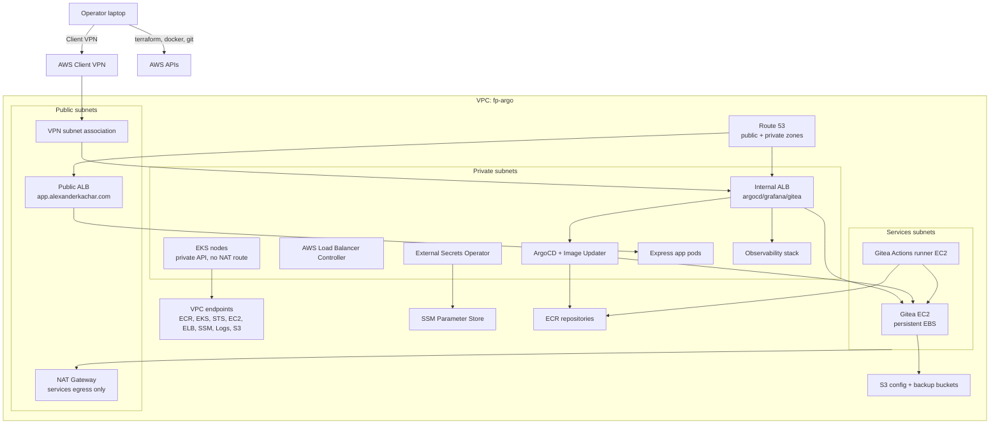

# Architecture

This platform runs a private EKS cluster with GitOps, internal CI/CD, and no public internet path from cluster nodes. It is built for short portfolio work sessions: spin up, test the full flow, then tear down while preserving Gitea state on EBS and S3.

## Goals

- Keep EKS private: private API endpoint, private nodes, no NAT route from cluster subnets.
- Keep CI/CD inside the VPC: Gitea server plus Gitea Actions runner.
- Use Git as the deployment source of truth: ArgoCD app-of-apps from Gitea.
- Avoid long-lived Kubernetes secrets in Terraform: SSM Parameter Store plus External Secrets Operator.
- Make teardown cheap and repeatable: destroy compute, preserve Gitea state.

## Network

The VPC spans two Availability Zones and three subnet tiers.

- `public` - public ALB for the Express app, NAT Gateway for services subnet egress, Client VPN association.
- `private` - EKS nodes and internal ALB. These subnets do not route through NAT.
- `services` - Gitea server and Gitea Actions runner. These keep NAT egress for first-boot Docker/GitHub downloads and action mirroring.

Private EKS nodes reach AWS APIs through VPC endpoints:

- Interface endpoints: ECR API, ECR DKR, EKS, EKS Auth, STS, EC2, ELB, SSM, SSM Messages, EC2 Messages, CloudWatch Logs.
- Gateway endpoint: S3.

## Ingress

There are two ALBs.

- Public ALB: `app.alexanderkachar.com`, internet-facing, app target group only.
- Internal ALB: `argocd.alexanderkachar.com`, `grafana.alexanderkachar.com`, `gitea.alexanderkachar.com`, reachable from VPC and VPN CIDRs.

ArgoCD and Grafana bind Kubernetes services to pre-created internal ALB target groups through `TargetGroupBinding`. Gitea is an EC2 target registered directly.

## Identity

- Operator access: AWS credentials plus AWS Client VPN.
- EKS add-ons and controllers: EKS Pod Identity.
- Gitea Actions runner: EC2 instance profile.
- Gitea server: EC2 instance profile for SSM, S3 config, S3 backups, and SSM parameters under `/fp-argo/gitea/*`.

Pod Identity roles exist for:

- AWS Load Balancer Controller.
- External Secrets Operator.
- ArgoCD application controller.
- ArgoCD Image Updater.
- EBS CSI controller.

## Secrets

Terraform and bootstrap scripts store long-lived platform values in SSM Parameter Store under `/fp-argo/`.

Examples:

- `/fp-argo/gitea/admin-password`
- `/fp-argo/gitea/admin-api-token`
- `/fp-argo/gitea/runner-registration-token`
- `/fp-argo/gitea/platform-deploy-token`
- `/fp-argo/gitea/express-app-deploy-token`

External Secrets Operator reads SSM through Pod Identity and creates Kubernetes `Secret` resources for ArgoCD repository credentials and Image Updater write-back credentials.

## GitOps Flow

1. Operator connects through Client VPN and pushes to Gitea.
2. Gitea Actions runner builds the Express app image.
3. Runner pushes `express-app:<sha>` and `express-app:latest` to ECR.
4. ArgoCD Image Updater polls ECR through VPC endpoints.
5. Image Updater commits the new image tag to `express-app/chart/values-override.yaml`.
6. ArgoCD detects the Git change and syncs the app.
7. AWS Load Balancer Controller updates target registrations for `TargetGroupBinding`.

## Diagram

## Layers

`terraform/infra/environments/dev` creates AWS infrastructure:

- VPC and subnet tiers.
- VPC endpoints.
- EKS cluster and managed node group.
- ECR repositories.
- IAM roles and Pod Identity roles.
- Route 53 zones and records.
- Public and internal ALBs.
- Gitea server and runner.
- S3 config and backup buckets.
- Client VPN.

`terraform/platform/environments/dev` installs cluster components:

- AWS Load Balancer Controller.
- External Secrets Operator and `ClusterSecretStore`.
- ArgoCD and ArgoCD Image Updater.
- ArgoCD bootstrap chart: internal ALB binding, Gitea repo credentials, and root Application.

## Lifecycle Model

`make spin-up` runs the whole cold-start path. `make teardown-soft` backs up Gitea and destroys compute while keeping the Gitea data EBS volume. The next spin-up passes that volume ID back into Terraform. `make teardown-hard` deletes the preserved volume after an explicit confirmation variable.

This keeps idle costs low without pretending that a single EC2-backed Gitea instance is production HA.
